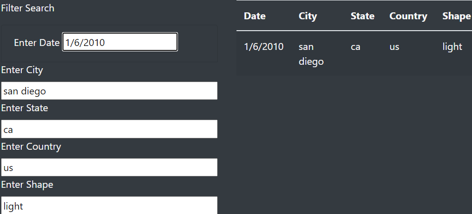

# UFOs

## Overview

The purpose of this project is to build a table of UFO sighting data using HTML with auxiliary JavaScript functions to filter the table by date, country, state, city, and UFO description (shape).

## Results

After cloning the repository, simply open the index.html file in your browser.  Then, enter your filter terms in the boxes provided, as the following image shows.

You may apply a filter in as many or as few input boxes as you wish, and the table will update itself using the functions defined in the app.js file.

## Summary

This is a good starting point for filtering large data sets in a browser using JavaScript functions; however, one finds a drawback in that the search terms must be exact matches (white space and case sensitive).

I would recommend implementing regex matching in the app.js file or modifying the user input before applying the filters so that the syntax of the search terms are a bit looser.  

We also have data on the duration of the sighting; unfortunately, the duration values are not standardized.  We could address this and apply a duration filter in two ways: We could update the data.js file to standardize the durations so that filtering by duration would be simple, or we could create a duration filter which uses regex matching to filter the data by duration.